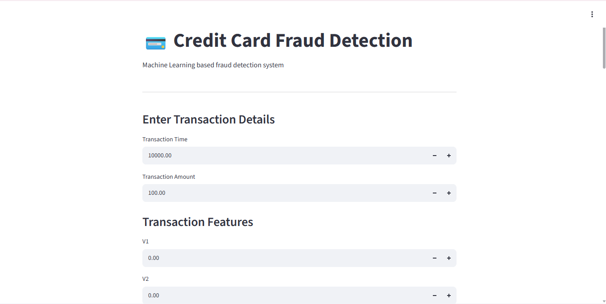

# credit-card-fraud-detection
Machine Learning based Credit Card Fraud Detection using Python, SMOTE, Random Forest and Streamlit.
# 💳 Credit Card Fraud Detection

A machine learning project that detects potentially fraudulent credit card transactions using Python and supervised learning techniques.

## 📌 Project Overview

Credit card fraud detection is a binary classification problem where the goal is to identify whether a transaction is:

* `0` → Legitimate
* `1` → Fraudulent

The dataset is highly imbalanced because fraudulent transactions represent only a very small portion of all transactions.

This project addresses the class imbalance using **SMOTE (Synthetic Minority Oversampling Technique)** and compares multiple machine learning models.

## 🚀 Technologies Used

* Python
* Pandas
* NumPy
* Matplotlib
* Seaborn
* Scikit-learn
* Imbalanced-learn
* Joblib
* Streamlit

## 🧠 Machine Learning Workflow

```text
Dataset
   ↓
Data Exploration
   ↓
Data Preprocessing
   ↓
Feature Scaling
   ↓
Train/Test Split
   ↓
SMOTE
   ↓
Model Training
   ↓
Model Evaluation
   ↓
Model Saving
   ↓
Streamlit Deployment
```

## 🤖 Models Used

### 1. Logistic Regression

Used as a baseline classification model.

### 2. Random Forest

An ensemble learning model consisting of multiple decision trees.

The Random Forest model was trained on the balanced training data generated using SMOTE.

## ⚖️ Handling Class Imbalance

The dataset contains significantly more legitimate transactions than fraudulent transactions.

SMOTE was applied **only to the training dataset** to generate synthetic examples of the minority class.

This prevents the test set from being artificially modified and provides a more realistic evaluation.

## 📊 Random Forest Results

| Metric    |  Score |
| --------- | -----: |
| Accuracy  | 99.85% |
| Precision | 54.49% |
| Recall    | 86.73% |
| F1 Score  | 66.93% |
| ROC-AUC   | 97.47% |
| PR-AUC    | 83.65% |

Because the dataset is highly imbalanced, accuracy alone is not sufficient to evaluate the fraud detection system. Precision, Recall, F1 Score and PR-AUC provide additional information about minority-class performance.

## 🌐 Streamlit Application 



The project includes an interactive Streamlit application.

Users can enter:

* Transaction Time
* Transaction Amount
* V1–V28 anonymized features

The application returns:

* Fraudulent or Legitimate classification
* Fraud probability

## 📁 Project Structure

```text
credit-card-fraud-detection/
│
├── fraud_detection.ipynb
├── app.py
├── fraud_detection_model.pkl
├── scaler.pkl
├── requirements.txt
└── README.md
```

## ▶️ How to Run

### 1. Clone the repository

```bash
git clone https://github.com/Karthick-N28/credit-card-fraud-detection.git
cd credit-card-fraud-detection
```

### 2. Install dependencies

```bash
pip install -r requirements.txt
```

### 3. Run the Streamlit application

```bash
streamlit run app.py
```

The application will open in your browser.

## 📦 Dataset

The project uses the widely used Credit Card Fraud Detection dataset containing anonymized transaction features.

The dataset is not included in this repository because of its large file size.

## ⚠️ Disclaimer

This project is intended for educational and portfolio purposes. The anonymized transaction features and model predictions should not be treated as a production financial fraud detection system.

## 👨‍💻 Author

**Karthick N**

B.E. Electronics and Communication Engineering

Interested in AI/ML, Embedded Systems, IoT and Software Development.
